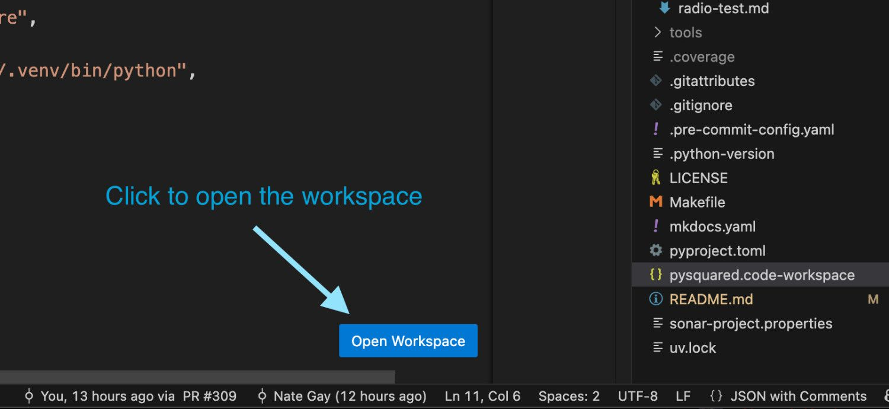

# Contributing Guide
Welcome to the contributing guide for PySquared! This guide will help you set up your development environment and get you started with contributing to the repository.

### Setting up your code editor

#### Workspaces

Working with the PySquared repo is different from working with other Python repos because part of the repo is designed to run on CircuitPython (e.g. the flight software) while another part is designed to run on standard CPython (e.g. the tests and development tools). To make the development experience as smooth as possible, we use [`uv`](https://docs.astral.sh/uv) workspaces for python environment management, a CircuitPython specific [`typeshed`](https://peps.python.org/pep-0561/) to give developers accurate type information for CircuitPython code, and [`pyright`](https://github.com/microsoft/pyright) configurations to control when the CircuitPython typeshed is loaded.

To experience the best development environment, we recommend using a code editor that supports [code workspaces](https://code.visualstudio.com/docs/editing/workspaces/workspaces) such as VS Code. When you open up the PySquared repository in your editor, open the workspace file located at `pysquared.code-workspace` and click `Open Workspace`. This will reload VS Code into workspace mode.



When you're in workspace mode, your editor will be able to autocomplete and tell you if you have any type errors in your code for both CircuitPython and CPython.


!!! question "Not using VS Code?"
    If you're using a different code editor and you have configured it to provide this functionality, please consider contributing a section to this guide to help others get set up.

#### Dev Containers

Every repository comes with a `.devcontainer` directory that contains configuration for a ready-to-use development environment. This environment includes all the necessary tools and dependencies to work on the repository. You can use any code editor that supports dev containers, such as [Visual Studio Code](https://code.visualstudio.com/), to open the repository in a dev container.

### Testing custom versions of PySquared

If you're making a change to PySquared, you can test it in a board specific repository by installing a specific version of PySquared.

Start by pushing your PySquared changes to a branch in the pysquared repository. Then, you can install that version of PySquared in a board specific repository by running the following command:

```sh
PYSQUARED_VERSION=<version_commit_or_branch_name> make install-flight-software BOARD_MOUNT_POINT=<board_mount_point>
```

If you've forgotten how to find your board's mount point, the instructions are in the [Getting Started Guide](getting-started.md).

### Testing Documentation Changes
We use [MkDocs](https://www.mkdocs.org/) to build our documentation. If you make changes to the documentation, you can build and test it locally by running:

```sh
make docs
```

This will generate the documentation and serve it locally. You can then open your web browser and navigate to `http://localhost:8000` to see the changes.

## Continuous Integration (CI)
This repo has a continuous integration system using Github Actions. Anytime you push code to the repo, it will run a series of tests. If you see a failure in the CI, you can click on the details to see what went wrong.

### Common Build Failures
Here are some common build failures you might see and how to fix them:

#### Lint Failure
Every time you make a change in git, it's called a commit. We have a tool called a pre-commit hook that will run before you make each commit to ensure your code is safe and formatted correctly. If you experience a lint failure you can run the following to fix it for you or tell you what's wrong.
```sh
make fmt
```

#### Test Failure
To ensure our code works as we expect we use automated testing. If you're seeing a testing failure in your build, you can see what's wrong by running those tests yourself with:
```sh
make test
```

#### Type Checking Failure
We use a tool called pyright to check our code for type errors. An example of a type error is if you try to add a string and an integer together. Pyright will catch these errors before they cause problems in your code. If you see a type checking failure in your build, you can run the following command to see what the error is:
```sh
make typecheck
```
